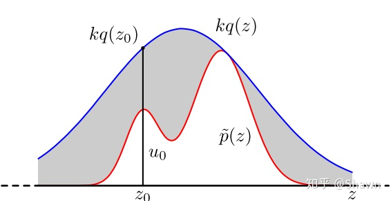

# RL-Reinforce

强化学习-Reinforce 调研与实现

## Log

---

### 2021/7/1

* [x] 调研-优势函数
  * **优势函数其实就是将Q-Value“归一化”到Value baseline上**，这样有助于提高学习效率，同时使学习更加稳定；同时经验表明，优势函数也有助于减小方差，而方差过大是导致过拟合的重要因素。
  * 实现方法：使用状态价值V 函数作为Baseline，优势函数 A = Q - V，使用A 重写Loss 中的价值函数

---

### 2021/7/5

* [x] 调研-important sampling
  * 蒙特卡罗采样 --- 蒙特卡洛方法是一种近似推断的方法，通过采样大量粒子的方法来求解期望、均值、面积、积分等问题，蒙特卡洛对某一种分布的采样方法有直接采样、接受拒绝采样与重要性采样三种，直接采样最简单，但是需要已知累积分布的形式。接受拒绝采样与重要性采样适用于原分布未知的情况，这两种方法都是给出一个提议分布，不同的是接受拒绝采样对不满足原分布的粒子予以拒绝，而重要性采样则是给予每个粒子不同的权重
    * 直接采样: 直接采样的方法是根据概率分布进行采样。对一个已知概率密度函数与累积概率密度函数的概率分布，我们可以直接从累积分布函数（cdf）进行采样，在其值域[0, 1]上均匀采样，然后通过cdf的反函数获取x
    * 接受-拒绝采样: p(z)是我们希望采样的分布，q(z)是我们提议的分布(proposal distribution)，令kq(z)>p(z)，我们首先在kq(z)中按照直接采样的方法采样粒子，接下来判断这个粒子落在途中什么区域，对于落在灰色区域的粒子予以拒绝，落在红线下的粒子接受，最终得到符合p(z)的N个粒子
    
    * 重要性采样(important sampling): **给予每个粒子不同的权重，使用加权平均的方法来计算期望**
  * 什么时候会用到重要性采样？
    * 强化学习算法有两个策略：一个用于决策的 *behavior policy μ*，一个用于更新的 *target policy π*，当*μ*和*π*一样时就是On-Policy，不一样时就是Off-Policy算法。
    * 在贝尔曼方程中需要计算的下一个状态的Q函数是基于概率分布*π*的，而Off-Policy使用*μ*进行决策(为了进行探索)，两种策略不一致时才需要重要性采样

---

### 2021/7/9

* [x] 交叉熵 - **用来衡量在给定的真实分布下，使用非真实分布所指定的策略消除系统的不确定性所需要付出的努力的大小**
  * 
  * 其中，p 表示真实分布(目标策略), q 表示非真实分布(采取的策略)。在机器学习中的分类算法中，我们总是最小化交叉熵，因为交叉熵越低，就证明由算法所产生的策略最接近最优策略，也间接证明我们算法所算出的非真实分布越接近真实分布。
  * [参考资料 - 如何通俗的解释交叉熵与相对熵？](
https://www.zhihu.com/question/41252833/answer/195901726)

---

### 2021/7/11

* [x] **Policy Gradient** - **Off-policy**- **Important Sampling**
  * On-policy: 学习到的agent以及和环境进行互动的agent是同一个agent
  
    Off-policy: 学习到的agent以及和环境进行互动的agent是不同的agent
  
  * **为什么引入Off-policy**

    <code>如果我们使用 πθ 来收集数据，那么参数 θ 被更新后，我们需要重新对训练数据进行采样，这样会造成巨大的时间消耗。
    目标：利用 πθ′ 来进行采样，将采集的样本拿来训练 θ， θ′ 是固定的，采集的样本可以被重复使用。</code>
  * **Important Sampling**
    
    当我们只有通过另外一个分布得到的样本时，期望值可以做出以下更改，更换分布之后，需要使用重要性权重 p(x)/q(x) 来修正 f(x) ，这样就实现了使用q分布来计算p分布期望值。
    
  
    <code>从上述important sampling的思想出发，可以使用该思想来达到上文所述的目标，即 “利用 πθ′ 来进行采样，将采集的样本拿来训练 θ ，θ′ 是固定的，采集的样本可以被重复使用” 表示为：</code>
    
  
  * **Tips**:
    1. <code>Advantage function (收益reward减去基准baseline) 也应该随着新的采样参数而变化（从基于θ 的Aθ 变为基于θ′ 的Aθ′）</code>
    2. p q 分布之间的差异依旧不宜过大

---
